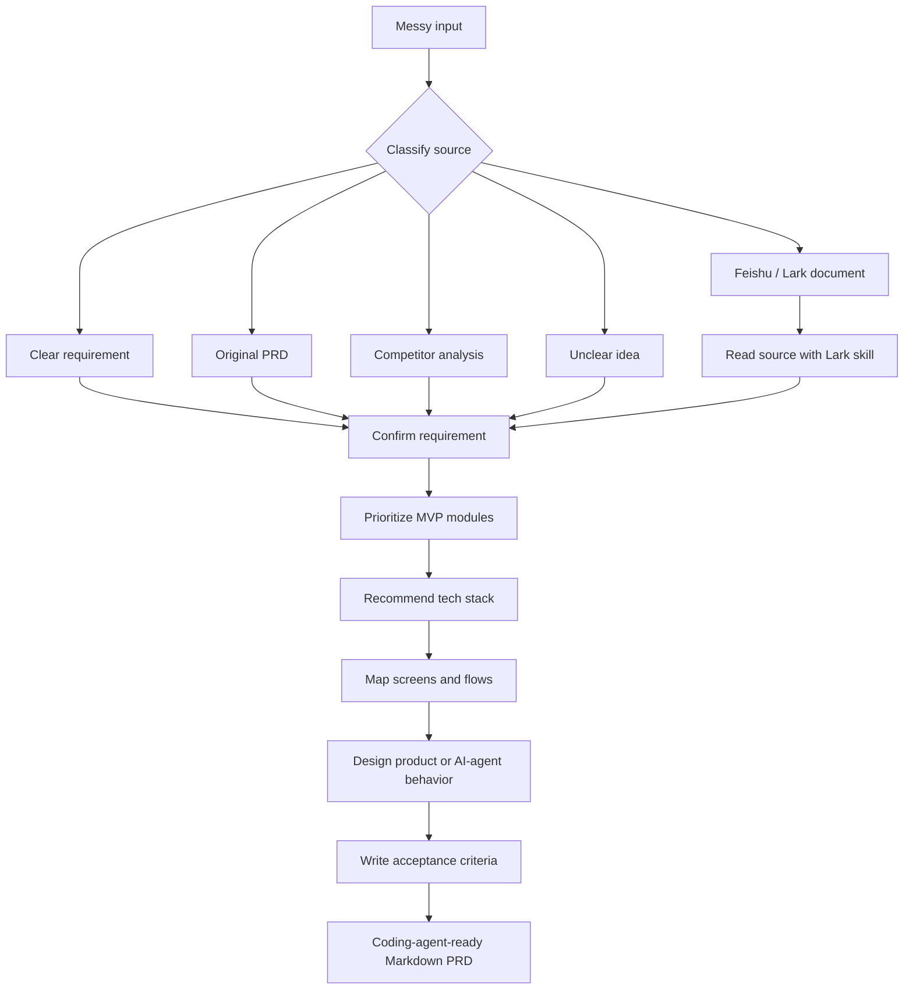

# Vibe PRD Skill

<p align="center">
  
  
  
  
</p>

<p align="center">
  <strong>Turn messy product thinking into a compact PRD that coding agents can build from.</strong>
</p>

<p align="center">
  Vibe PRD helps Codex, Claude Code, and other coding agents clarify requirements, design MVP scope,
  recommend a practical stack, outline screens, and write observable acceptance criteria.
</p>

## At A Glance

| Input | Vibe PRD does | Output |
|---|---|---|
| Rough idea | Asks only the missing high-impact questions | Confirmed requirement definition |
| Long PRD | Extracts build-relevant behavior and constraints | Concise implementation brief |
| Feishu/Lark link | Routes to the right document skill before analysis | Source-grounded PRD |
| Competitor notes | Separates observations from requirements | Confirmable MVP direction |
| AI product concept | Designs agent workflow, prompts, tools, and fallback behavior | AI-ready product spec |

## Workflow



## What It Produces

| Section | Why it matters |
|---|---|
| Requirement definition | Locks target user, scenario, problem, product form, and success outcome |
| Scope and priority | Turns broad ideas into build-now, later, and out-of-scope decisions |
| User flow | Shows the main path a builder should optimize for |
| Wireframe-level screens | Gives enough structure for implementation without high-fidelity design overhead |
| Recommended stack | Explains pragmatic technology choices in plain language |
| Functional design | Defines behavior, data, integrations, permissions, states, and edge cases |
| AI agent design | Captures prompts, tools, workflow, memory, confirmations, and failure handling |
| Acceptance criteria | Converts each feature into observable checks |

## Output Preview

```markdown
# Vibe Coding PRD: Meeting Notes Organizer

## 2. Requirement Definition
- Target user: Team members who need action-focused meeting summaries
- Scenario: After a meeting transcript or notes document is available
- Problem: Raw notes are too long and hard to turn into work items
- Product form: Internal web tool with an AI summarization workflow
- Success outcome: User gets an editable summary, decisions, and action list

## 10. Acceptance Criteria
### Feature: Generate meeting summary
- Given a user pasted meeting notes
- When they click `Generate PRD`
- Then the system shows a loading state and returns editable Markdown
```

## Installation

Clone this repository into your Codex skills directory:

```bash
mkdir -p ~/.codex/skills
git clone https://github.com/xan226the-oss/vibe-prd-skill.git ~/.codex/skills/vibe-prd
```

Restart Codex or reload skills, then invoke:

```text
$vibe-prd 帮我把这个需求转成可以给 coding agent 的 PRD
```

## Example Inputs

```text
$vibe-prd 帮我写一个用来 vibe coding 的 PRD：我要做一个团队内部的会议纪要整理工具
```

```text
$vibe-prd 转写这个飞书 PRD：https://example.feishu.cn/wiki/xxxxx
```

```text
$vibe-prd 下面是竞品分析，帮我整理成 MVP 产品需求和验收标准
```

## Repository Structure

```text
.
├── SKILL.md
├── agents
│   └── openai.yaml
├── README.md
├── LICENSE
└── .gitignore
```

## Design Principles

| Principle | Meaning |
|---|---|
| Coding-agent-ready | Focus on what needs to be built, not business ceremony |
| Compact | Remove market, OKR, stakeholder, and strategy prose unless it changes behavior |
| Explicit uncertainty | Keep unresolved assumptions in `Open Questions` |
| MVP-first | Prioritize the main user flow, data, permissions, and acceptance criteria |
| Nontechnical-friendly | Explain stack tradeoffs plainly before locking a recommendation |

## Best Used For

- Turning messy product ideas into buildable specs
- Converting long PRDs into concise implementation briefs
- Preparing requirements for Claude Code, Codex, or similar coding agents
- Designing AI product workflows, prompts, tools, memory, and fallback behavior
- Writing acceptance criteria before implementation begins

## Not Intended For

- High-fidelity visual design
- Market sizing or strategy documents
- Legal, medical, or financial advice
- Replacing user confirmation when requirements are ambiguous

## License

MIT
